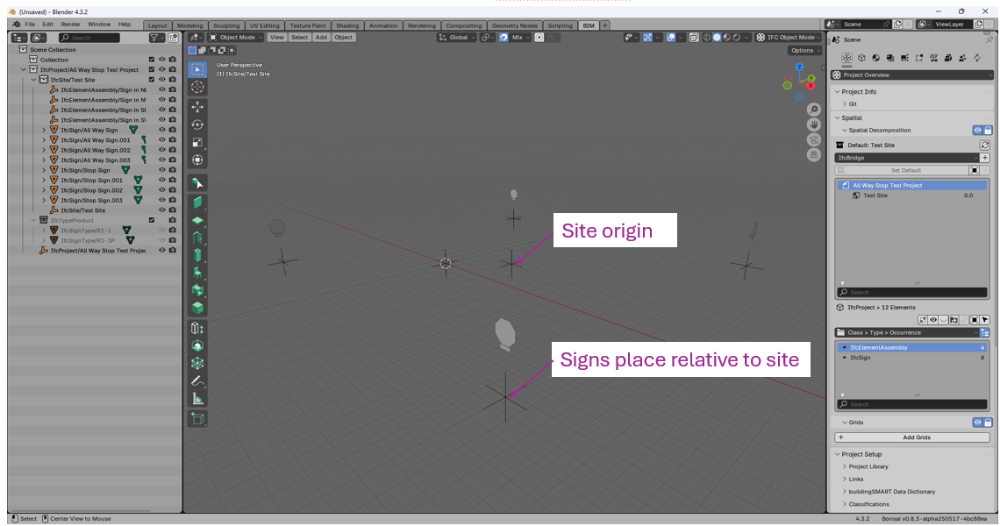

# Introduction
This repository contains scripts developed in support of the WSDOT ADCMS grant project for sign lifecycle asset management. The purpose of these scripts is to illustrate authoring IFC models of signs, demonstrate sign classification and attribution using the buildingSmart Data Dictionary service, and prototype a method by which IFC models of signs can be created from sign data in an external data source. For this particular set of scripts, the external data source is data collected from LiDAR scans and processed by AI to identify sign features and related information. Other data sources could be agency sign databases and sign data systems. The general concepts remain the same regardless of the data source(s).

The IFC4X3 ADD2 specification is used for modelling. This is the first IFC specification that supports infrastructure. IfcSign and IfcSignType are new entities that are not available in earlier IFC specifications.

Scripts are written in Python and use the [IfcOpenShell toolkit](https://ifcopenshell.org). Screenshots are from the Bonsai plug-in to Blender.

All the resulting IFC files have been validated through the [buildingSmart Validation Service](https://validate.buildingsmart.org).

The geometric representation of signs are limited to an extruded solid that does not represent the actual sign face, materials, or style information. Sign posts and other supporting structures are not modeled (signs are floating in space). Material data is not modeled. The important part of these examples are the overall sign geometry, object placement, and the attached properties and attributes, not the human-friendly rendering or modelling of all attributes and properties. 

There is a very recent discussion on [LinkedIn ](https://www.linkedin.com/posts/marcinpszczolka_we-are-considering-supporting-textures-in-activity-7327593678804287488-1eu_/) about using texture maps to represent sign faces. This is a possibility, but has its drawbacks.

# IfcSign model with bSDD classification
The script illustrates an IfcSign model with attributes and properties classified using the [WSDOT Sign Data Dictionary](https://identifier.buildingsmart.org/uri/wsdot/wsdotsigns/0.1.0) hosted on the buildingSmart Data Dictionary Service (bSDD). The sign in this model has a simple geometric representation as a tesselated surface in the shape of a square. This key elements of this example is the classification, attribution, and properties using the WSDOT sign data dictionary in the buildingSmart Data Dictionary service. 

The generating script and resulting IFC file are:

[Build_Sign_with_bSDD_Classification.py](Build_Sign_with_bSDD_Classification.py)

[bSDD_Classified_Sign.ifc](bSDD_Classified_Sign.ifc)

# MUTCD Sign Library
When developing the IfcSign with bSDD Classification example, it quickly became apparent that a library of predefined IfcSignType entities for the MUTCD would be very useful. Ultimately, publication of such a library should be the responsibility of FHWA, possibly developed in collaboration with AASHTO. This script generates two prototype libraries.

The prototype MUTCD sign libraries are limited in scope and only includes the signs in [Chapter 2b](https://mutcd.fhwa.dot.gov/pdfs/11th_Edition/Chapter2b.pdf) and [Chapter 2c](https://mutcd.fhwa.dot.gov/pdfs/11th_Edition/Chapter2c.pdf) that do not have variable dimensions. This is more than enough for proof of concept.

The [Build_Sign_Library.py](Build_Sign_Library.py) script reads a CSV file with sign information, including Name, Designation, MUTCD Section, sizes for various applications, and a shape code. 

The [MUTCD_Sign_Definitions.csv](MUTCD_Sign_Definitions.csv) file was created with the following steps:
1) Save [Chapter 2b](https://mutcd.fhwa.dot.gov/pdfs/11th_Edition/Chapter2b.pdf) and [Chapter 2c](https://mutcd.fhwa.dot.gov/pdfs/11th_Edition/Chapter2c.pdf) PDF files as Word documents
2) Copy the sign information tables from Word to Excel
3) Manually adjust the sign information so every sign type is on a single line
4) Exclude all signs with variable dimensions (variable dimensions adds complexity not germane to this prototyping activity).
5) Append a sign shape code to each sign type; O=octagon,T=triangle/yield, R=rectangle,P=pennant
6) Save as a csv file

The [Build_Sign_Library.py]() script reads the [MUTCD_Sign_Definitions.csv](MUTCD_Sign_Definitions.csv) file and creates an IFC model with two IfcProjectLibrary instances. To keep the focus on the sign type libraries, bSDD content is not include. However, this can be easily added later once the DD content stabilizes.

The "Unit Sign" IfcProjectLibrary instance has each sign type defined with unit dimensions. That is, all dimensions (X,Y,Z) have a value of 1". The idea is to limit the size of the library by reducing the number of geometric representations. When the geometry is mapped from IfcSignType to an instance of IfcSign the height, width, and thichness can be scaled to their actual values with IfcCartesianTransformationOperator3DnonUniform.

The "Sign" IfcProjectLibrary instance has an entry for each sign type with its respective dimensions, such as R1-1 30x30, 36x36, and 48x48. Only the sign thickness needs to be scaled with IfcCartesianTransformationOperator3DnonUniform.

The resulting IFC file is [MUTCD_Sign_Library.ifc](MUTCD_Sign_Library.ifc)

# All Way Stop Example
The All Way Stop example is a contrived 4-way intersection with a Stop (R1-1) and All Way (R1-3P) sign in an IfcElementAssembly at each approach to the intersection.

This example illustrates:
1) Placement of object relative to an IfcSite coordinate system (a local project coordinate system). This may be preferred to having objects defined in state plane or other coordinate systems. Objects are relative to the site origin and reposition if the site origin is modified.
2) Modeling of an assembly of signs, which is very common.
3) Placement of signs relative to the assembly location
4) Use of the IfcSignType entities defined in the prototype MUTCD sign library.

The generating script and resulting IFC file are:

[Build_All_Way_Stop_Model.py](Build_All_Way_Stop_Model.py)

[All_Way_Stop.ifc](All_Way_Stop.ifc)

# Signs with Linear Placement Example
This example demonstrates positioning objects in an IFC model using IfcLinearPlacement and a linear referencing system. The example model is an IfcAlignment with 90-deg horizontal curve. Along the curve are 10 W1-8R Chevron signs.

The generating script and resulting IFC file are:

[Build_signs_with_Linear_Placement.py](Build_signs_with_Linear_Placement.py)

[Signs_with_Linear_Placement.ifc](Signs_with_Linear_Placement.ifc)

# Test Corridor Signs
This example builds a model with all of the signs in the [Sign_Face.csv](Sign_Face.csv) file from the Mach9 data source.

The data is in HARN.WA-SF (HPGN Washington, South, US Foot).

Assume sign orientation is a direction measured from East and represents the plane of the face of the sign as observed by someone reading the sign.

The purpose of the example is to demonstrate generating a model with many signs defined in external data sources. The following simplifications are made to limit the complexity of the script and keep it focused on its primary objective:

1) Signs are named with their ObjectID and description from the source data. This makes it easy to look up the sign data in the csv file for any IfcSign in the model.
2) Sign records with MUTCD designations that are available in the IfcProjectLibrary use the first IfcSignType with that designation along with the associated geometric representation. The sign width and height in the source data are ignored. The size of the sign will be different than the source data, however this avoids the complexity of mapping the source data dimensions to predefined sign sizes. This complexity doesn't add value to the example.
3) Sign records without MUTCD designations and those with designations but not available in the IfcProjectLibrary, use an extruded rectangular shape for the geometric representation. The rectangle dinensions are taken directly from the source data.
4) All signs are 1" thick.

3091 signs are modeled. 1416 of them use types defined in the MUTCD sign library.

The generating script and resulting IFC file are:

[Build_Test_Corridor_Signs.py](Build_Test_Corridor_Signs.py)

[Test_Corridor_Signs.ifc](Test_Corridor_Signs.ifc)

# Sign Data Information Delivery Specification
This final example demonstrates the bSI Information Delivery Specification (IDS) concept. The [Signs.ids](signs.ids) contains information specifications that models must satisify. The IFC models are evaluated against the IDS and a report is generated by an IDS Checker software, such as IfcTester from the IfcOpenShell toolkit.

The buildingSmart Validation Service validates an IFC model for proper STEP syntax, adherance to the IFC schema, and modeling rules but does not evalute if a model contains the proper or required information. An IDS Checker evaluates the information in an IFC model against information requirements defined in an IDS.

This example IDS requires that every IfcSignType with a PredefinedType=PICTORAL has a Name that matches the pattern of an MUTCD designtion defined by a regular expression. The IDS also requres signs have Width and Height properties in Qto_SignBaseQuantities.

Most of the signs in these example IFC models will pass the MUTCD designation check. None of them will pass the properties checks. These results are intentional so that both passing and failing tests are demonstrated.

# Use Cases for Sign Models
When signs are modeled with an internationally accepted data standard and schema, IFC4X3, the possibilities are nearly boundless. The following supposes some use cases for sign models that may be in our future.

## Automated design of signage for a highway project
During the development phase a project, software could use the roadway geometric and other related data to automatically determine the number, type, size, and location of signs that conform to the requirements of the MUTCD and other design specifications and criteria. This can potentially reduce design time and cost. Some software may already do this.

## Automated evaluatation of as-build signs
A corrilary to the first use case is automated evaluatation of as-build conditions against MUTCD and other design specifications and criteria. Signage that does not conform to standards can be identified and corrected, as needed. This can be done as a construction activity and through the lifespan of the asset.

## Evaluation of proposed changes to signing standards
Periodically, standards like the MUTCD change. With all sign data in a consistent format, automated assessments of proposed standards changes can be made. If the sign data is in state-by-state custom formats, national evaluation is difficult. However, if every state had sign data in national standard format, nationwide evaluatation of proposed changes to standards and regulations can be more easily made.

## Better informed sign maintenance
With sign data in a consistent format, predictive algorithms can be ran against the data to estimate when and where certain types of maintenance activities might be needed in the future. An example is addressing overgrown vegetation that obscures signs. Mixed with the LiDAR data and sign models, sign obstruction can be identified and maintenance plans can be developed. Predictive algorithms could estimate rates of vegetation grown and predict when in the future signs may become obscured and the future maintenance actions can be budgeted, planned, and scheduled. Similar predictions could be made about degredation of sign faces due to UV exposure based on the sign's location and orientation with respect to sunlight exposure. Past weather data, cloud cover data, coupled with future exposure predictions and degedation models could inform sign maintenance and replacement decision making and risk assessment.

The possibilities are nearly boundless.
